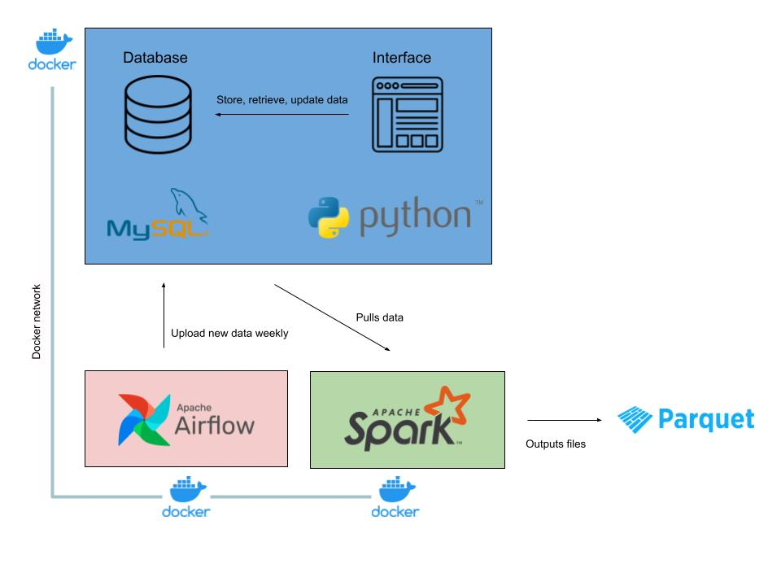

# Employee Database Management System

Data modeling is an important job of a Data Engineer. So, in this project, I designed a RDBMS (Relational Database Management System) for employee management applications to practice this skill. The project is broken into 2 parts. The first part is building the database that will house all the data. The second part is designing the interface to interact with the database.  

To launch this application, follow these steps:

1. Build the RDBMS
```bash
make execute
```

2. Run the RDBMS (database takes approximately 20 seconds to bootup)
```bash 
python3 interface.py
```

3. Update RDBMS with new employees via Airflow (must keep computer running)
```bash
cd airflow; docker compose up
```

4. Shut down Airflow
```bash
docker compose down --volumes --rmi all
```

5. Destroy the RDBMS (when it is no longer needed)
```bash
make unexecute
```  

The database has been populated with dummy data. So, feel free to experiment with the interface!  

*Please note that any changes made in the database will be lost when the container is shut down and started again.*

## Technologies

* MySQL
* Docker
* Python (mysql-connector-python)
* Airflow
* Spark (PySpark)



## Overview of Docker

Docker is a platform that enables developers to build, deploy, run, update, and manage containers. Containers are a package of software that includes everything needed to run an application: code, dependencies, etc. Containers are isolated from each other and can be ran in different environments (Windows, macOS, GCP, etc.). They allow reproducibility, local experiments, and running pipelines on the cloud.

### General Workflow
Dockerfile: a text file you create that builds a Docker image.  

Docker image: a file containing instructions to build a Docker container.  

Docker container: a running instance of a Docker image
* Since a Docker image is just a snapshot, any modifications performed in the container will be lost upon restarting the container  

Docker compose (docker-compose.yml): a file to deploy, combine, and configure many Docker images at once.  

Dockerfile -> (build) -> Image -> (configure) -> docker-compose.yml -> (run) -> Container  

Docker volume: file system mounted on Docker container to preserve data generated by the running container (stored on the host, independent of the container life cycle.  

“Docker rule” is to outsource every process to its own container.  

## Overview of Airflow

Airflow is the most popular workflow orchestration tool. DAGs, or directed acyclic graphs, specify the dependencies between a set of tasks with explicit execution order, and have a beginning as well as an end. A task is defined as a unit of work (aka, operators in Airflow). The tasks themselves describe what to do, be it fetching data, running analysis, triggering other systems, or more. It is good practice to move the data processing tasks to separate scripts. In other words, DAGs should only be used to schedule tasks. The actual work that takes place within the tasks during execution should be seperate from the DAG.

### General Architecture

Webserver: GUI to inspect, trigger and debug the behavior of DAGs and tasks. Available at http://localhost:8080.  

Scheduler: Monitors all tasks and DAGs, then triggers the task instances once their dependencies are complete.  

Worker: This component executes the tasks given by the scheduler.  

Metadata Database (Postgres): Backend to the Airflow environment. Used by the Scheduler, Executor and Webserver to store state.  

DAG Directory: Location for storing all DAGs.  

## Overview of Spark

Spark is a data processing framework that can quickly perform processing tasks on very large datasets, and can also distribute data processing tasks across multiple computers, either on its own or in tandem with other distributed computing tools.

### General Architecture:

- Write Spark code on computer
- Code is submitted to Spark master
- Spark master coordinates between executors to perform Spark jobs
- The executors pull data partitions from the data repositories, processes it, and writes the results to a location  

Spark is distributed so it can have a cluster, and within the cluster there can be many machines that work together to process the data in parallel  

Spark is a multi-language engine. Scala is the native way of communicating with Spark. PySpark is a wrapper around Spark.  

General rule of thumb: If the data can be expressed using SQL and regular data processing frameworks like pandas can manipulate the data reasonably fast, then use it. Otherwise, Spark is the way to go.  

Hadoop is different because it stores the data on the executors (with redundancy in case a node fails). The idea was to not download data because it was slow due to their large size. Instead code, which is smaller in size, is sent to the executors that already have the data to do the processing.  

But these days, Spark clusters and data centers live together. So downloading data is very fast. Despite Spark being a little bit slower than Hadoop, it is not significant and has more upsides.

## Database Principles

A brief overview of important database concepts.

### 1) Overview
Data modeling is the process of creating a visual representation of either a whole information system or parts of it to communicate connections between data points and structures.  

Goal is to illustrate types of data used and stored, relationships among these data types, and the ways the data can be grouped and organized and its formats and attributes.  

Data models built around business needs. Rules and requirements defined upfront through feedback from business stakeholders so they can be incorporated into the design of a new system or adapted into an existing one.  

*Benefits of data modeling:*
* Provides project scope
* Acts as documentation
* Improves performance
* Reduces data and application errors  

*Types of data models (hierarchy):*
* Conceptual data models:
    * Establish the entities and their relationships
* Logical data models
    * Define the attributes and elaborate on their relationships
        * Ex. Entity Relationship diagram (ERD), Key-Based model (KB), Fully-Attributed model (FA)
* Physical data models
    * Describes the database-specific implementation of the data model

*Data modeling process:*
* Identify the entities of business importance
* Identify key attributes of each entity
* Identify relationships among entities
* Map attributes to entities completely
* Assign keys as needed and decide on a degree of normalization (that balances the need to reduce redundancy with performance requirements)
* Finalize and validate the data model

### 2) Relational Databases

Relational Database: a type of database that stores and provides access to data points that are related to one another 

RDBMS: The software used to store, manage, query, and retrieve data stored in a relational database  

Data Integrity: having correct data in database (no repeating or incorrect values and broken relationships)
* Entity integrity:  each row of a table has a unique and non-null primary key
* Referential integrity: each value in the foreign key must have a matching value in the primary key or it must be null
* Domain integrity: all data values in each column must be valid (proper data type and length)

Relationships: associations between entities (tables)
* One-to-one: a record in one table has a connection to a single record in another table
* One-to-many: a record in one table has connections to multiple records in another table
* Many-to-many: multiple records in one table have connections with multiple records in another table (incompatible with relational databases)

Parent tables: contain the primary key.  

Child tables: contain the foreign key
* A child table always points back at the parent table.  

Look-up table: a table that has two columns: "key" and "value". The keys are usually integers or short string codes. The keys are being used by other tables. Thus, we can quickly search data because the lookup keys are connected to all the corresponding rows.  

Cardinality: the maximum number of times a row in one table can relate to the rows in another table  

Modality: the minimum number of times a row in one table can relate to the rows in another table

### 3) Schemas
Structured data: made up of well-defined data types with patterns that make them easily searchable  

Unstructured data: made up of files in various formats, such as videos, photos, texts, audio, and more  

Data engineers collect unstructured data, transform it into structured data, and store it in database management systems (DBMS) to make it available for analysis  

A schema is a collection of database objects  

There are a variety of ways to arrange schema objects in the schema models designed for data warehousing:
* Star Schema: (the simplest)
    * Design: contains a fact table at the center connected to a number of associated dimensional tables
        * Fact table: contains all the primary keys of the dimensional tables and stores quantitative information for analysis
        * Dimensional tables: provide descriptive information for all the quantitative information in the fact table (thus dimensional tables are relatively smaller than fact tables). Commonly used dimensions: people, products, place, and time


* Snowflake Schema: (variant of Star Schema)
    * Design: contains a fact table at the center connected to a number of associated dimensional tables that have their own sub-dimensional tables


* Galaxy Schema:
    * Design: contains two fact tables that share dimensional tables between them and have their own dimensional tables


### 4) Keys

Natural key: a set of attributes that already exist in the table that can be used to make keys (see below)  

Surrogate key: a system generated attribute with no business meaning that can be used to make keys (see below)  

Super key: a set of attributes (can include unnecessary attributes) that can uniquely identify each row in a table (there can be many Super keys in a table)

* Candidate key: a subset of Super keys devoid of any unnecessary attributes that are not important for uniquely identifying each row in a table (there can be many Candidate keys in a table)

    * Primary key: Out of all the Candidate keys, we pick the one that has a minimal, non-null set of attributes that can uniquely identify each row in a table (there can only be one Primary key in a table)

    * Alternate key: Any of the remaining Candidate keys

Foreign key: an attribute that is a Primary key in its parent table, but is included as an attribute in the child table to generate a relationship between them (each value in the foreign key must correspond to a value in the primary key otherwise it should be null)  

Simple key: a key made up of one column  

Composite key: a key made up of two or more columns  

Compound key: a key made up of two or more foreign keys from different tables  

### 5) Normalization

Partial dependency: when a non-key column in a table is not dependent on the entire primary key  

Functional dependency: when a non-key column in a table is dependent on the entire primary key  

Transitive dependency: when a column is dependent on another column through a dependency (A -> C because A -> B where B -> C) and causes a FD  

Normalization: the process by which data in a relational database is organized to eliminate data redundancy by removing all model structures that provide multiple ways to know the same fact

* First Normal Form:
    * All column values are atomic
* Second Normal Form:
    * It is in 1NF
    * No partial dependencies, otherwise the column(s) should be moved to another table
* Third Normal Form:
    * It is in 2NF
    * No transitive dependencies, otherwise the column(s) should be moved to another table  

Denormalization: the process of adding precomputed redundant data to an otherwise normalized relational database to improve read performance of the database

### 6) Index

Non-clustered index: list of indices where each index points to all the corresponding rows  

Clustered index: list of indices where each index points to a block containing all the corresponding rows (actually reorganizes the data)  

## Data Model

I used an ER (entity relationship) diagram to build a logical model for the relational database.  


## Database Design

The `EMPLOYEE` table contains the following variables with their corresponding data types: `FNAME (VARCHAR-15)`, `MINIT (CHAR)`, `LNAME (VARCHAR-15)`, `SSN(CHAR-9)`, `BDATE (YYYY-MM-DD)`, `ADDRESS (VARCHAR-30)`, `SEX (CHAR)`, `SALARY (DECIMAL-10,2)`, `SUPER_SSN (CHAR-9)`, `DNO (INT)`.
* Primary key: `SSN`  

The `DEPARTMENT` table contains the following variables with their corresponding data types: `DNAME (VARCHAR-15)`, `DNUMBER (INT)`, `MGR_SSN (CHAR-9)`, `MGR_START_DATE (YYYY-MM-DD)`.
* Primary key: `DNUMBER`
* Unique: `DNAME`
* Foreign key: `MGR_SSN` references `SSN` in `EMPLOYEE`  

The `DEPT_LOCATIONS` table contains the followung variables with their corresponding data types: `DNUMBER (INT)`, `DLOCATION (VARCHAR-15)`
* Primary key: `DNUMBER`, `DLOCATION`
* Foreign key: `DNUMBER` references `DNUMBER` in `DEPARTMENT`  

The `PROJECT` table contains the following variables with their corresponding data types: `PNAME (VARCHAR-15)`, `PNUMBER (INT)`, `PLOCATION (VARCHAR-15)`, `DNUM (INT)`
* Primary key: `PNUMBER`
* Unique: `PNAME`
* Foreign key: `DNUM` references `DNUMBER` in `DEPARTMENT`  

The `WORKS_ON` table contains the followung variables with their corresponding data types: `ESSN (CHAR-9)`, `PNO (INT)`, `HOURS (DECIMAL-3,1)`
* Primary key: `ESSN`, `PNO`
* Foreign key: `ESSN` references `SSN` in `EMPLOYEE`, `PNO` references `PNUMBER` in `PROJECT`  

The `DEPENDENT` table contains the following variables with their corresponding data types: `ESSN (CHAR-9)`, `DEPENDENT_NAME (VARCHAR-15)`, `SEX (CHAR)`, `BDATE (YYYY-MM-DD)`, `RELATIONSHIP (VARCHAR-8)`
* Primary key: `ESSN`, `DEPENDENT_NAME`
* Foreign key: `ESSN` references `SSN` in `EMPLOYEE`

## How the Database Works

The database was created in MySQL and saved as a `.sql` file, called `database.sql`,  in `./containers/warehouse/`. It was containerized with a `docker-compose.yml` file in order to isolate the database from the local system and ensure reproducibility on other systems as long as they have Docker installed.  

### Process

The database is stored in the container named `warehouse`.  

A MySQL base image was used to build the container. 

`restart` was set to `always` in the `docker-compose.yml` to ensure the container continuously runs.  

Several important MySQL parameters were passed into the container from environment variables defined in the `.env` file of this repository through the `docker-compose.yml` file. For the purposes of this project, the MYSQL_USER, MYSQL_PASSWORD, and MYSQL_ROOT_PASSWORD were set to `root`. Please note that the passwords that were used are not secure and in a real-life application, stronger passwords should be used to increase security.

The `MYSQL_DATABASE` is set to `WAREHOUSE` in the `docker-compose.yml` file, which is consistent with the schema defined in `database.sql`. It is important that the schema, or database, is the same or the database will not be succesfully built.  

`ports` is used to specifify the host port and container port (host:container) so that a connection can be established to this container from within and without. When container ports are mentioned in the `docker-compose.yml` file, they will be shared amongst services started by that docker-compose because they are on the same network.  

`volumes` provides the path to the `database.sql` file so that the database can be imported into the container when the `docker-compose.yml` file is run.  

To check that the database was succesfully containerized, follow these steps:

1. Open `Terminal`, navigate to the main folder of this repo
2. Start containers and services
```bash
docker compose up
```

3. Access the `warehouse` container
```bash
docker exec -it warehouse bash
```

4. Within the container, execute the following commands:

    - Login to MySQL using the information from the `.env` file
    ```sql
    mysql -u root -p root
    ```

    - Show all schemas in MySQL (should see `WAREHOUSE` schema)
    ```sql
    show schemas; 
    ```

    - Select the `WAREHOUSE` schema
    ```sql
    use WAREHOUSE;
    ```

    - Show all the tables in that schema (should see 6 tables)
    ```sql
    show tables;
    ```

5. If everything in step 4 is satisfied, destroy the containers.
```bash
docker compose down --volumes --rmi all
```

## How the Interface Works

The interface was created in Python and can be located in `./containers/interface/` as `interface.py`. It was containerized using a docker-compose.yml and Dockerfile to ensure reproducibility of the project, manage python dependencies, and connect the interface to the database via a Docker network.  

### Process

The Dockerfile uses a Python base image. It starts by creating a directory called `main`, which will serve as the primary working directory. The `interface.py` and `requirements.txt` files are copied into the container. All the Python dependencies listed in the `requirements.txt` are then installed via pip. Finally, an `ENTRYPOINT` instruction is executed to keep the container running so that a user can access the interface via the container.  

Earlier I mentioned that the `MYSQL_USER` and `MYSQL_PASSWORD` are just `root`. The MYSQL root account possesses the most priviliges to the database. So, only the admin should have access to this. Any other user that wants access to the database should be given only the priviliges that are necessary for them to fulfill their duties by creating a new user account with the aforementioned priviliges. However for the purpose of this project, I don't create such user and simply use the root account in the interface.  

In order to connect the interface to the database, the `mysql-connector-python` Python library had to be used. The connection required 5 key pieces of information: `host`, `port`, `username`, `password`, and `database`. The `username`, `password`, and `database` can be found in the environment as `MYSQL_USER`, `MYSQL_PASSWORD`, and `MYSQL_DATABASE`, respectively, because we imported them as environmental variables in the docker-compose.yml. The `port` is `3306` as defined in the docker-compose.yml file on line 13. As for the `host`, since all services defined by docker-compose.yml are in the same Docker network, the interface can locate the database with the name of the database container as the host: `warehouse`.  

For a while, I had to keep re-building the images and re-running the containers everytime I made a modification to the code in order to see if a bug was resolved. But that was time consuming. So, I decided to install vim in the container and debug my program straight from the container to increase efficiency. This can be done by following these steps:

1. Access the container
```bash
docker exec -it interface bash
```

2. Update apt-get
```bash
apt-get update
```

3. Install Vim
```bash 
apt-get install vim
```

4. Open Python file with Vim
```bash
vim interface.py
```  

Now that a connection has been established, an interface was built and 11 functions were implemented so that a user can interact with the database. The interface is a simple command line based interface made in Python. There is certainly room to make a GUI based interface in the future!  

Here are the functions that the interface offers:

* Add a new employee
* View a current employee's information
* Modify a current employee's information
* Remove an employee
* Add a dependent to an employee
* Remove a dependent from an employee
* Add a new department
* View a current department's information
* Remove an existing department
* Add a new department location to a department
* Remove a department location from a current department  

To check that the interface was successfully containerized, follow these steps:  

1. Open `Terminal`, navigate to the main folder of this repo
2. Start containers and services
```bash
docker compose up
```

3. Access the `interface` container
```bash
docker exec -it interface bash
```

4. Run the interface (should see the interface menu)
```bash
python3 interface.py
```

5. If step 4 is satisfied, destroy the containers
```bash
docker compose down --volumes --rmi all
```  

Record locking is the technique of preventing simultaneous access to data in a database, to prevent inconsistent results. In MySQL, record locking can be used by including a `FOR UPDATE` statement at the end of the query. Upon commiting the execution of the query statement to the database, the record locking is then lifted. In this project, simultaneous access shouldn't be a concern. But record locking is an important technique to utilize when building a RDBMS to ensure data integrity. Therefore, record locking was used in this project to practice this concept.

## How the Workflow Orchestrator Works

Every week, Airflow will insert 10 employees into the database to simulate a live, production RDBMS where new employees are being hired.

### Setup

- In the main directory, make a folder called `airflow` and run this command:
```bash
curl -LfO 'https://airflow.apache.org/docs/apache-airflow/2.5.0/docker-compose.yaml'
```

- Initialize the database
```bash
docker compose up airflow-init
```

- Connect the Airflow DAG to the Database using a Docker network:
    
    - Now add the following to the `docker-compose.yml` file in the `airflow` directory: (when the docker-compose.yml for the interface and warehouse is run, a `erdbms_default` network is created that we can add to this docker-compose.yml as an external network)

        - Enter the following below `services`:
        ```bash
        networks:
            default:
                name: erdbms_default
                external: true
        ```

- Create a Dockerfile to install Python dependencies in Airflow container:

    - Go to `airflow` directory and create Dockerfile
    ```bash
    touch Dockerfile
    ```

    - `requirements.txt` contains all the Python dependencies required

    - Enter the following in the Dockerfile:
    ```bash
    FROM apache/airflow:2.2.3

    USER root

    RUN apt-get update

    COPY requirements.txt .
    RUN pip install -r requirements.txt
    ```

    - Go to the `docker-compose.yml` file and add the following:
    ```bash
    build:
        dockerfile: ./Dockerfile
    ```

- Create the DAG:

    - All connection information is stored in the `.env` file, but they were hard coded into the DAG for simplicity
    - `data_generator` function will create new employees to insert into the database
    - `insert_to_db` function will perform the insertion of data into the database

- Run the DAG:

    - Start all Airflow services by going to the `airflow` directory and entering the following:
    ```bash
    docker compose up
    ```

    - Airflow Webserver UI will be accessible at: http://localhost:8080/. Username = `airflow` and Password = `airflow`

    - Trigger the DAG

## How to Generate Reports Using Spark

- Run the PySpark container (download from Docker Hub) and connect to RDBMS network
```bash
docker run -p 8888:8888 \
    --name=spark_reports \
    --network=erdbms_default \
    jupyter/pyspark-notebook
```

- Copy Jupyter notebook to container
```bash
docker cp ./spark/reports.ipynb spark_reports:./home/jovyan/
```

- Go to the URL at the end of the prompt to access the server

- Run the entire notebook

- Reports will be located in ./work/data/ (download if needed)

- Use Control-C to stop this server and shut down all kernels (twice to skip confirmation)

- Destroy image and container
```bash
docker kill spark_reports
docker rm spark_reports
docker image rm jupyter/pyspark-notebook
```